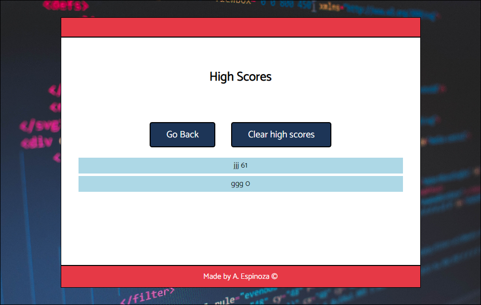

# Coding-Quiz

## Description

This coding quiz helps the user test their knowledge in JavaScript coding. Testing is very common during job interviews and this test will prepare the user by asking a set of multiple choice questions that runs with a 75 seconds timer. The time will be shorten by 10 seconds every time the user selects an incorrect answer. At the end of the test, a final score is given. The user can store their score and replay to improve it.

## Installation

N/A

## Usage

**Website link: (https://anabel-espinoza.github.io/Coding-Quiz/)**

1. The quiz starts once the user clicks the 'Start Quiz' button. The timer on the top right corner of the test window will start counting down from 75 seconds.
2. The questions will be displayed one at the time. Each question has four possible options for the user to select the correct one by clicking on it. 
3. A message will appear under the options to tell the user if his answer was correct or not. In the case it's not correct, 10 seconds will be deducted from the timer.
4. The next question will appear on the screen immediately. The test will be over when all the questions have been aswered or the timer reaches 0.
5. The final score will be displayed, which is the seconds left on the timer. The user may input their initials to record their score. 
6. When the score is saved, the list of saved scores is displayed on the screen. The user can delete previous scores by clicking on the "Clear High Scores" button.
7. The user can retake the test by clicking "Go Back".

The website looks like the following image (images for start game/question example/save score/high scores):

## Credits

- Created by: Anabel Espinoza (https://github.com/Anabel-Espinoza)

## License

- MIT Licensed.
---
